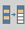
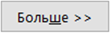
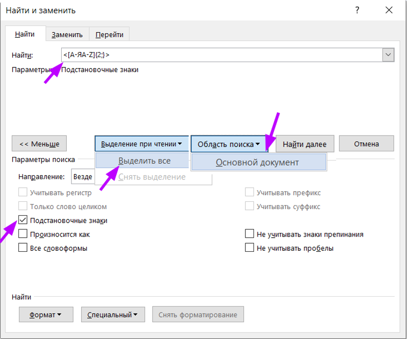
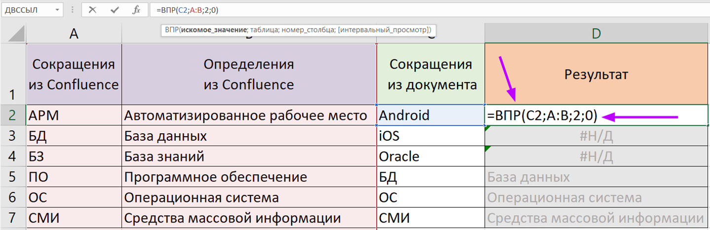

## Создание перечня терминов и сокращений (лайфхак)

### Создание первичного списка 

1.  Читаем документ подряд и, не задумываясь о повторении, в Excel в
    столбец выписываем всё, что нужно пояснить.

2.  Для сформировавшегося столбца применяем функцию "Данные" -> "Удалить дубликаты" 

3.  Сортируем в алфавитном порядке. Список готов для вставки в документ.

### Формирование списка сокращений

1.  В документе выполняем расширенный поиск по параметрам, для этого:

    1.  вызываем функцию "Найти и заменить" (ctrl+f);

    2.  нажимаем кнопку "Больше"
        

    3.  в поле поиска пишем формулу <[А-ЯA-Z]{2;}>, где значение
        маски: "Для букв от А до Я и от A до Z (в верхнем регистре)
        выбираем буквосочетания от двух букв и более символов".

    4.  в параметрах ставим "Подстановочные знаки";

    5.  в параметре "Выделение при чтении" выбираем значение
        "Выделить все";

    6.  в параметре "Область поиска" выбираем значение "Основной
        документ";

    7.  нажимаем "Найти". 

2.  Копируем выделенные значения в Excel в столбец.

3.  Удаляем дубликаты.

4.  Выстраиваем по алфавиту. Список готов для вставки в документ.

Для быстроты работы можем заготовить перечень определений и сокращений в Конфлюенс. На основе этого
списка можно с использованием Excel подготовить выборку для тех сокращений, которые у есть в документе, а именно:

1.  используем таблицу в Excel, где столбцы расположены в следующем
    порядке:

    1.  Сокращение из Confluence (столбец А)

    2.  Определение из Confluence (столбец В)

    3.  Сокращение из документа (столбец С)

    4.  Определение для документа (столбец D).

2.  прописываем для всех ячеек столбца D "Сокращение для документа",
    начиная с ячейки D2, результирующую функцию =ВПР() в следующем
    формате (!справедливо именно для указанного выше расположения
    столбцов): =ВПР(Cх;A:B;2;0), где х - номер ячейки С (С2, С3, С4 и
    т.д.).
    Где функция ВПР (искомое значение; диапазон поиска; номер столбца с
    входным значением; 0 или 1). 0 -- точное значение, 1 --
    приблизительное значение. В нашем случае мы в ячейки столбца D
    согласно значению ячейки столбца **С** ищем в диапазоне столбцов
    **А** и **В**  совпадения, и при точном совпадении (**0**) берем
    значение из **2** столбца, то есть столбца В.

    По умолчанию таблица должна быть отсортирована по возрастанию.
    есть "Н/Д", то:

    1.  нет искомого значения;

    2.  в искомом термине опечатка;

    3.  есть лишние пробелы в термине/сокращении, взятом из документа.

        

3.  Список готов для вставки в документ. Куда - смотрим [в сравнении ГОСТов](https://xoma-san.github.io/xoma-book/GOST/GOST-srav/).

## Магия Word

### Оформление перекрестных ссылок
Если необходимо использовать только номер только номер постоянной части
таблицы или рисунка, то в код поля нужно добавить параметр « \# \0 »
(пробел в конце обязателен). 

Например, REF \_Ref79670754 \h \# \0. Измененное поле обновить.

Поле вернет вместо "Таблица 1" только "1".  поле необходимо обновить.

### Формат А2 в документах Word

Максимальный размер стороны страницы, поддерживаемый Word, - 55.87 см, а размер
А2 - 42х59.4 см.

#### Возможное решение 1
1.  Создать отдельный документ Word.
2.  Выставить размеры страницы 42х55,87 см (или наоборот, в зависимости
    от ориентации листа).
3.  Настроить поля, колонтитулы.
4.  Вставить и масштабировать рисунок (не забыть про подпись к рисунку).
5.  Сохранить. Сохранить в pdf (при необходимости).
6.  При печати выбрать в свойствах принтера размер А2. Оценить
    размещение на листе. При необходимости скорректировать размещение
    элементов в исходном Word-файле и повторить дальнейшие шаги.

#### Возможное решение 2
Использование Excel. Excel позволяет установить формат А2 при условии
использования принтера, поддерживающего формат А2.