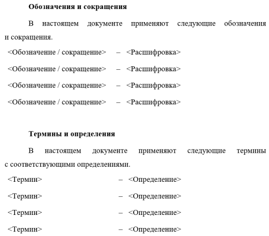
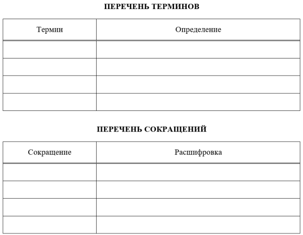
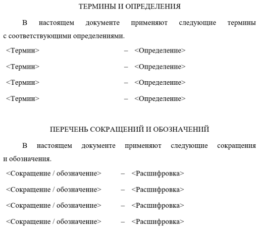

В стравнении учтены ГОСТы:

* ГОСТ 2.105-2019 "Единая система конструкторской документации. Общие требования к текстовым документам".
* ГОСТ 19.106-76 "Единая система программной документации. Требования к программным документам, выполненным печатным способом".
* ГОСТ 7.32-2017 "Система стандартов по информации, библиотечному и издательскому делу. Отчет о научно-исследовательской работе. Структура и правила оформления".
* ГОСТ 7.0.97-2016 "Система стандартов по информации, библиотечному и издательскому делу. Организационно-распорядительная документация. Требования к оформлению документов".

## Сравнение ГОСТ&nbsp;2 и ГОСТ&nbsp;19

|**Элемент**       |**ГОСТ&nbsp;2**                                             |**ГОСТ&nbsp;19**                                           |
|------------------| ------------------------------------------------------| -----------------------------------------------------|
|**Текст (абзац)** подробнее   [в Общей информации](https://xoma-san.github.io/xoma-book/GOST/GOST-svod/) |ГОСТ 2.105 п.5.1   ГОСТ 2.105 п.7: Документы, cодержащие текст, разбитый на графы, при необходимости разделяют на разделы и подразделы, которые не нумеруют. Наименования разделов и подразделов (при наличии) записывают в виде заголовков с прописной буквы и подчеркивают. |ГОСТ 19.106 п.2.1.6: Каждый структурный элемент начинается с абзацного отступа.   п.1.2: <...> на одной стороне листа, через два интервала; допускается через один или полтора интервала. |
| **Заголовок 1&nbsp;ур. (Раздел)**    | ГОСТ 2.105 п.6.5, 6.6: Заголовки следует печатать с прописной буквы без точки в конце, полужирным шрифтом, не подчеркивая.  **  1 Название   2 Название** | ГОСТ 19.106 п.2.1.7: Заголовки разделов пишут прописными буквами и размещают симметрично относительно правой и левой границ текста. Каждый раздел рекомендуется начинать с нового листа.   п. 2.1.9 нумеровать арабскими цифрами с точкой (+ Приложение 2 ГОСТа).   1. Название   2. Название | 
|**Заголовок 2&nbsp;ур. (Подраздел)**|ГОСТ 2.105 п.6.5, 6.6: Заголовки следует печатать с прописной буквы без точки в конце, полужирным шрифтом, не подчеркивая.  **  1.1 Название   2.1 Название** |ГОСТ 19.106 п.2.1.7: Заголовки подразделов записывают с абзаца строчными буквами (кроме первой прописной). п.2.1.9: нумеровать арабскими цифрами с точкой (+Приложение 2 ГОСТа)   1.1. Название   1.2. Название|
|**Заголовок 3&nbsp;ур. (Пункт)**|ГОСТ 2.105 п.6.5, 6.6: Заголовки следует печатать с прописной буквы без точки в конце, полужирным шрифтом, не подчеркивая.  **  1.1.1 Название   2.1.1 Название**|ГОСТ 19.106 п.2.1.7: Заголовки подразделов записывают с абзаца строчными буквами (кроме первой прописной). п.2.1.9: нумеровать арабскими цифрами с точкой (+Приложение 2 ГОСТа)   1.1.1. Название   1.1.2. Название|
|**Заголовок 4&nbsp;ур. (Подпункт)**|ГОСТ 2.105 п.6.5, 6.6: Заголовки следует печатать с прописной буквы без точки в конце, полужирным шрифтом, не подчеркивая.  **  1.1.1.1 Название   2.1.1.1 Название**|ГОСТ 19.106 п.2.1.7: Заголовки подразделов записывают с абзаца строчными буквами (кроме первой прописной). п.2.1.9: нумеровать арабскими цифрами с точкой (+Приложение 2 ГОСТа)   1.1.1.1. Название   1.1.1.2. Название|
|**Примечание**|ГОСТ 2.105 п.6.12, п.6.12.3: Если примечание одно, то после слова «Примечание» ставится тире и примечание печатается тоже с прописной буквы. Одно примечание не нумеруют. Несколько примечаний нумеруют по порядку арабскими цифрами.   "Примечание - Текст"   "Примечания  1 Текст.   2 Текст."|ГОСТ 19.106 п.2.7: Одно примечание не нумеруется. После слова "Примечание" ставят точку. Несколько примечаний следует нумеровать по порчдку арабскими цифрами с точкой. После слова "Примечание" ставят двоеточие.   "Примечание. Текст"   "Примечания:   1. Текст.   2. Текст."|
|**Рисунок**| ГОСТ 2.105 п.6.9: <...> следует нумеровать арабскими цифрами сквозной нумерацией, приводя эти номера после слова «Рисунок».   Графический материал, при необходимости, может иметь наименование и пояснительные данные (подрисуночный текст). Слово «Рисунок» и его наименование, отделенное тире, помещают после пояснительных данных.   Допускается не нумеровать небольшие рисунки, размещенные непосредственно в тексте и на которые в дальнейшем нет ссылок. Допускается нумеровать графический материал в пределах раздела. В этом случае номер графического материала состоит из номера раздела и порядкового номера графического материала, разделенных точкой. При ссылках на графический материал следует писать «...в соответствии с рисунком 2». |ГОСТ 19.106 п.2.3: Иллюстрации, если их в данном документе более одной, нумеруют арабскими цифрами в пределах всего документа.   Ссылки на иллюстрации дают по типу: "рис.12" или "(рис.12)". Ссылки на ранее упомянутые иллюстрации дают с сокращенным словом "смотри", например "см. рис.12".   Иллюстрации могут <...> иметь подрисуночный текст. С вниманием к 2.3.1 и положению текста, его подписи и номеру под рисунком. |
|**Таблица**|ГОСТ 2.105 п.6.8 с примером: Таблицы каждого приложения обозначают отдельной нумерацией арабскими цифрами с добавлением перед цифрой обозначения приложения. Если в документе одна таблица, она должна быть обозначена «Таблица 1»   На все таблицы документа должны быть приведены ссылки в тексте документа, при ссылке следует писать слово «таблица» с указанием ее номера.   Головка таблицы должна быть отделена двойной линией от остальной части таблицы.   Внимательно к 6.8.8, отдельный столбец нумерации использовать не допускается |ГОСТ 19.106 п. 2.6^ Ссылка на 1.5-2001 (см. п. 4.5 с примером) Слева над таблицей размещают слово "Таблица", выделенное разрядкой. После него приводят номер таблицы, <...> точку после номера таблицы не ставят.   При необходимости краткого пояснения и/или уточнения содержания таблицы приводят ее наименование, которое записывают с прописной буквы над таблицей после ее номера, отделяя от него тире. При этом точку после наименования таблицы не ставят.   Головку таблицы отделяют от остальной части таблицы двойной линией.|
|**Сноска**|ГОСТ 2.105 п.6.13: Сноски в тексте располагают с абзацного отступа в конце страницы, на которой они обозначены. и отделяют от текста короткой тонкой горизонтальной линией с левой стороны. Знак сноски выполняют арабскими цифрами со скобкой и помещают на уровне верхнего обреза шрифта. Допускается вместо цифр выполнять сноски символом «звездочка» (*). Применять более трех звездочек не рекомендуется.   В конце сноски ставим точку: сноска является элементом библиографического описания. Независимо от назначения, правила представления элементов библиографического описания, применение знаков предписанной пунктуации осуществляется в соответствии с ГОСТ 7. 1 и ГОСТ 7.82. Согласно ГОСТ 7.1 в конце библиографического описания ставится точка. |ГОСТ 19.106 п.2.2.4 Сноска обозначается цифрой со скобкой, вынесенными на уровень линии верхнего обреза шрифта. Текст сноски располагают в конце страницы и отделяют от основного текста линией длиной 3 см, проведенной в левой части страницы.   В конце сноски ставим точку: сноска является элементом библиографического описания. Независимо от назначения, правила представления элементов библиографического описания, применение знаков предписанной пунктуации осуществляется в соответствии с ГОСТ 7. 1 и ГОСТ 7.82. Согласно ГОСТ 7.1 в конце библиографического описания ставится точка. |
|**Формула**| ГОСТ 2.105 п.6.10 (есть пример): Пояснения символов и числовых коэффициентов, входящих в формулу, если они не пояснены ранее в тексте, должны быть приведены непосредственно под формулой. Пояснения каждого символа следует давать с новой строки в той последовательности, в которой символы приведены в формуле. Первая строка пояснения должна начинаться со слова «где» без двоеточия после него.   Нумеруются сквозной нумерацией арабскими цифрами, которые записывают на уровне формулы справа в круглых скобках. Ссылки в тексте на порядковые номера формул дают в скобках. | ГОСТ 19.106 п.2.4: Формулы в документе, если их более одной, нумеруются арабскими цифрами, номер ставят с правой стороны страницы, в скобках, на уровне формулы.   Значения символов и числовых коэффициентов, входящих в формулу, должны быть приведены непосредственно под формулой. Значение каждого символа печатают с новой строки в той последовательности, в какой они приведены в формуле. Первая строка расшифровки должна начинаться со слова „где”, без двоеточия после него. Если в программном документе приведен перечень этих символов и числовых коэффициентов, значения их под формулой допускается не приводить.|
|**Физ. величины**| ГОСТ 2.105 п.6.16: Числовые значения величин с обозначением единиц физических величин и единиц счета следует писать цифрами, а числа без обозначения единиц физ.величин и единиц счета от единицы до девяти - словами. Если приводят диапазон числовых значений физ.величины, выраженных в одной и той же единице физической величины, то обозначение единицы физической величины указывается после последнего числового значения диапазона. Исключение составляют "°С", "%", "°".   ГОСТ для обозначений физ.величин - ГОСТ 8.417 | Не регламентировано |
|**Числительные**|ГОСТ 2.105 п.6.16 Числовые значения величин с обозначением единиц физических величин и единиц счета следует писать цифрами, а числа без обозначения единиц физических величин и единиц счета от единицы до девяти - словами|Не регламентировано|
|**Нумерация страниц**|В рамке. Состав рамки согласно ГОСТ 2.104 |ГОСТ 19.106 п.2.1.2 Форма 1, поле 1: Сверху посредине листа над обозночением документа|
|**Дата**|Не регламентировано |Не регламентировано |
|**Размер полей (отступов)**|Регламентировано рамкой согласно ГОСТ 2.104. Расстояние до рамки ищем [тут](https://xoma-san.github.io/xoma-book/GOST/GOST-svod/)|ГОСТ 19.106 п. 1.5: <ul><li> верх - 25 мм, </li><li>  низ - 15 мм, </li><li>  левое - 20 мм,</li><li>  правое - 10 мм </li></ul>|
|**Общее кол. листов**|ГОСТ 2.104 п.4.1: реквизит 7 (графа 8 основной надписи первого листа)| ГОСТ 19.104 п.2.3: поле 5 (на титульном листе под обозначением документа)|
|**Перечень сокращений**| ГОСТ 2.105 п.6.1.1: в начале документа после содержания (подробнее ниже)| ГОСТ 19.106 п.1.6: в конце документа после приложений (подробнее ниже)|
|**Содержание**|ГОСТ 2.105 п.6.2: Номера подразделов приводят после абзацного отступа, равного двум знакам, относительно номеров разделов. После заголовка каждого из указанных структурных элементов ставят отточие, а затем приводят номер страницы ТД. на которой начинается данный структурный элемент.   Если документ разбит на части (книги), то в конце содержания первой части (книги) перечисляют обозначение и наименование (при наличии) остальных частей (книг). Содержание включают в общее количество страниц данного документа (части, книги) |ГОСТ 19.106 п.2.1.4: Снабжают заголовком "СОДЕРЖАНИЕ", не нумеруют как раздел. Включают номера разделов, подразделов, пунктов и подпунктов, имеющих заголовок, их наименование и номера страниц; номера и наименование (при наличии) приложений программного документа и номера страниц; прочие наименования (перечень рисунков, таблиц и т.п.) и номера страниц. Наименования, включенные в содержание, записывают строчными буквами. Прописными должны печататься заглавные буквы и аббревиатуры|
|**Перечисления**|ГОСТ 2.105 п.6.7: Перечисления записывают с абзацного отступа. Перед каждой позицией перечисления следует ставить дефис или, при необходимости ссылки в тексте документа на одно из перечислений, строчную букву русского или латинского алфавита, после которой ставится скобка. При необходимости дальнейшей детализации перечислений используют арабские цифры, после которых ставится скобка, а запись приводят с абзацного отступа:   а) текст;   б) текст:   &nbsp;&nbsp;&nbsp; 1) текст;  &nbsp;&nbsp;&nbsp; 2) текст.    Ссылки на третий и последующие уровни детализации не рекомендуются. |ГОСТ 19.106 п.2.1.6: Рекомендуется обозначать арабскими цифрами со скобкой: 1), 2) и т.д. Допускается выделять перечисления простановкой дефиса перед текстом.   Не рекомендуется делать ссылки на элементы перечисления. Каждый структурный элемент начинается с абзацного отступа. |

## Сравнение ГОСТ&nbsp;7.23 и ГОСТ&nbsp;7.0.97

|**Элемент**       |**ГОСТ&nbsp;7.32**                                          |**ГОСТ&nbsp;7.0.97**                                       |
|------------------| ------------------------------------------------------| -----------------------------------------------------|
|**Текст (абзац)** подробнее   [в Общей информации](https://xoma-san.github.io/xoma-book/GOST/GOST-svod/) |п. 6.1.1: Отчет НИР должен быть выполнен любым печатным способом на одной стороне листа формата А4 через полтора интервала. Допускается при подготовке заключительного отчета НИР писать через один интервал, (при объеме 500 и более страниц). Цвет шрифта — черный. Размер шрифта —  не менее 12 пт. Рекомендованный тип шрифта для основного текста — Times New Roman. Использование курсива допускается для обозначения объектов и терминов.| п. 3.1: Размер шрифтов рекомендованный к использованию: 12, 13, 14. п. 3.4: Текст документа печатается через 1-1,5 межстрочных интервала. Если документ готовится для издания с уменьшением масштаба, текст печатается через два интервала. Интервал между буквами в словах — обычный. Интервал между словами — один пробел. Текст документа выравнивается по ширине листа (по границам левого и правого полей документа).   п. 3.2: Допускается создание документов на лицевой стороне и оборотной сторонах листа. При двустороннем создании документов ширина левого поля на лицевой стороне листа и правого поля на оборотной стороне листа должны быть равны.|
|**Заголовок 1&nbsp;ур. (Раздел)**|п 6.2.1: Заголовки структурных элементов следует располагать в середине строки без точки в конце, прописными буквами, не подчеркивая. Каждый структурный элемент и каждый раздел основной части отчета начинают с новой страницы.   п.6.1.1: Полужирный шрифт применяют только для заголовков разделов и подразделов, заголовков структурных элементов.   п.6.4.1: Разделы должны иметь порядковые номера в пределах всего отчета арабскими цифрами без точки и расположенные с абзацного отступа   п. 5.4.1: При необходимости продолжение записи заголовка раздела, подраздела или пункта на второй (последующей) строке выполняют, начиная от уровня начала этого заголовка на первой строке, а продолжение записи заголовка приложения — от уровня записи обозначения этого приложения.|п. 3.4 Заголовки разделов и подразделов печатаются с абзацным отступом или центрируются по ширине текста. Заголовок нумеруется арабскими цифрами.   п. 5.17 (оформление реквизитов) Заголовок к тексту — краткое содержание документа. Заголовок к тексту формулируется с предлогом "О" ("Об") и отвечает на вопрос "о чем?": <ul><li> приказ (о чем?) о создании аттестационной комиссии; </li><li> приказ (о чем?) об утверждении штатного расписания; </li><li> письмо (о чем?) о предоставлении информации. </li></ul> Заголовок к тексту оформляется под реквизитами бланка слева, от границы левого поля. Заголовок к тексту может не составляется, если текст документа не превышает 4-5 строк.    п.5.18: Текст документа может содержать разделы, подразделы, пункты, подпункты, нумеруемые арабскими цифрами. Уровней рубрикации текста не должно быть более четырех|
|**Заголовок 2&nbsp;ур. (Подраздел)**|п. 6.4.1: Подразделы должны иметь нумерацию в пределах каждого раздела. Номер подраздела состоит из номера раздела и подраздела, разделенных точкой. В конце точка не ставится.   п. 6.4.2: Если отчет имеет подразделы, то нумерация пунктов должна быть в пределах подраздела и номер пункта должен состоять из номеров раздела, подраздела и пункта, разделенных точками. Пример:   3.1   3.1.1   3.1.2   Если раздел или подраздел состоит из одного пункта, то пункт не нумеруется. Если текст отчета подразделяется только на пункты, они нумеруются порядковыми номерами в пределах отчета. Пункты при необходимости могут быть разбиты на подпункты, которые должны иметь порядковую нумерацию в пределах каждого пункта: 4.2.1.1, 4.2.1.2 и т. д.   + требования к Заголовку 1 ур.|п. 3.4: Заголовки разделов и подразделов печатаются с абзацным отступом или центрируются по ширине текста. п.5.18: Текст документа может содержать разделы, подразделы, пункты, подпункты, нумеруемые арабскими цифрами|
|**Заголовок 3&nbsp;ур. (Пункт)**|п. 6.2.3: Пункты и подпункты могут иметь только порядковый номер без заголовка, начинающийся с абзацного отступа.   п. 5.4.1: Обозначения пунктов приводят после абзацного отступа, равного четырем знакам относительно обозначения разделов.| п.5.18: Текст документа может содержать разделы, подразделы, пункты, подпункты, нумеруемые арабскими цифрами|
|**Заголовок 4&nbsp;ур. (Подпункт)**|п. 6.2.3: Пункты и подпункты могут иметь только порядковый номер без заголовка, начинающийся с абзацного отступа. п. 5.4.1: Обозначения пунктов приводят после абзацного отступа, равного четырем знакам относительно обозначения разделов.|п.5.18: Текст документа может содержать разделы, подразделы, пункты, подпункты, нумеруемые арабскими цифрами|
|**Примечание**|п. 6.7 : Слово "Примечание" следует печатать с прописной буквы, с абзацного отступа, не подчеркивая. Примечания помещают после текстового, графического и др. материалов, к которым относятся эти примечания.    Если примечание одно, то после слова "Примечание" ставится тире и текст примечания печатают с прописной буквы. Одно примечание не нумеруется.    Несколько примечаний нумеруют по порядку арабскими цифрами без точки.   "Примечание - Текст"   "Примечания  1 Текст.   2 Текст." |Не регламентировано|
|**Рисунок**| п. 6.1.1: Иллюстрации должны соответствовать формату А4 (допускается формат А3) по ГОСТ 9327.   п. 6.5: Иллюстрации следует располагать после текста, где они упоминаются впервые, или на следующей странице. На все иллюстрации в отчете должны быть даны ссылки. При ссылке необходимо писать слово «рисунок» и его номер, например: «в соответствии с рисунком&nbsp;2».   Чертежи, графики, диаграммы, схемы, помещаемые в отчете, должны соответствовать требованиям стандартов Единой системы конструкторской документации (ЕСКД).   Иллюстрации нумеруются арабскими цифрами сквозной нумерацией (искл. иллюстрации в приложениях).   Иллюстрации при необходимости могут иметь наименование и пояснительные данные (подрисуночный текст). Слово «Рисунок», его номер и через тире наименование помещают после пояснительных данных и располагают в центре под рисунком без точки в конце.| Не регламентировано |
|**Таблица**|п. 6.1.1: Таблицы должны соответствовать формату А4 (допускается формат А3) по ГОСТ 9327.   п. 6.6: Таблицы следует располагать после текста, в котором она упоминается впервые, или на следующей странице. На все таблицы в отчете должны быть ссылки. При ссылке следует печатать слово "таблица" с указанием ее номера.   Наименование следует помещать над таблицей слева, без абзацного отступа в следующем формате: Таблица — Номер таблиц Наименование таблицы приводят с прописной буквы без точки в конце. См. пример оформления ГОСТ. Если наименование таблицы занимает две строки и более, то его следует записывать через один межстрочный интервал.   Если в отчете одна таблица, она должна быть обозначена "Таблица 1" или " Таблица А.1" (если она приведена в приложении А). |п. 3.3: При составлении таблиц допускается использовать текст меньших размеров (чем шрифт основного документа).|
|**Сноска**|п. 6.7: Знак сноски ставят без пробела после слова, числа, символа, предложения, к которому дается пояснение. Знак сноски указывается надстрочно арабскими цифрами. Допускается вместо цифр использовать знак звездочка *. Сноску располагают с абзацного отступа в конце страницы, на которой приведено поясняемое слово (словосочетание/данные). Сноску отделяют от текста короткой сплошной тонкой горизонтальной линией с левой стороны страницы.   В конце сноски ставим точку.|В конце сноски ставим точку|
|**Формула**|п. 6.8: Уравнения и формулы следуют выделять из текста в отдельную строку. Выше и ниже каждой формулы/уравнения должно быть оставлено не менее одной свободной строки. Если уравнение нет умещается в одну строку, оно должно быть перенесено после знаков: равенства (=), плюс (+), минус (-), умножения (х), деления (:) или др. математических знаков. На новой строке знак повторяется.   При переносе формулы на знаке, символизирующим операцию умножения, применяют знак "Х".   Пояснение значений символов и числовых коэффициентов приводят под формулой, в той же последовательности, в которой они представлены в формуле (с новой строки). Первую строку пояснения начинают со слова "где" без двоеточия с абзаца.    Формулы в отчете располагают по середине строки и обозначают порядковой нумерацией в пределах всего отчета порядковой нумерацией в круглых скобках в крайнем правом положении на строке. Одну формулу обозначают (1).|Не регламентировано |
|**Физ. величины**|Единицы физических величин в отчете НИР приводят по ГОСТ 8.417|Не регламентировано|
|**Числительные**|Не регламентировано|Не регламентировано|
|**Нумерация страниц**|п. 6.3: Страницы нумеруют арабскими цифрами, соблюдая сквозную нумерацию страниц по всему тексту отчета, вкл. приложения. Номер страницы проставляется в центре нижней части страницы без точки. Приложения, которые приведены в отчете НИР и имеющие собственную нумерацию, допускается не перенумеровывать.Титульный лист включают в общую нумерацию страниц отчета. Номер  страницы на титульном листе не проставляют. Иллюстрации и таблицы, расположенные на отдельных листах, в включают в общую нумерацию страниц отчета. Иллюстрации и таблицы на листе формата А3 учитывают как одну страницу.|п 3.2: При создании документа на двух и более страницах вторую и последующие страницы нумеруют. Номера страниц проставляются посередине верхнего поля документа на расстоянии не менее 10 мм от верхнего края листа.|
|**Дата**|6.10: <...> Дата согласования и утверждения оформляется арабскими цифрами в следующей последовательности: *день, месяц, год*. День и месяц оформляются двумя парами арабских цифр, разделенных точкой, год четырьмя арабскими цифрами. Допускается словесно-цифровой способ оформления даты.|п. 5.10: Дата документа записывается в последовательности - день месяца, месяц, год - одним из двух способов: <ul><li> арабскими цифрами, разделенными точкой: 05.06.2016; </li><li> словесно-цифровым способом, например: 5 июня 2016 г. </li></ul>|
|**Размер полей (отступов)**|п. 6.1.1: Размеры полей: <ul><li> левое — 30 мм; </li><li> правое — 15 мм; </li><li> верхнее и нижнее — 20 мм.</li></ul> Абзацный отступ должен быть одинаковым по всему тексту отчета и равен 1,25 см.| п.3.4: Абзацный отступ текста документа - 1,25 см.   Раздел 6: Каждый лист документа, оформленный на бланке или без него , должен иметь не менее: <ul><li> 20мм- левое; </li><li> 10 мм- правое;  </li><li> 20 мм - верхние;  </li><li> 20 мм- нижние. </li></ul> Документы длительных сроков хранения (свыше 10 лет) должны иметь левое поле не менее 30мм. |
|**Общее кол. листов**|В теле отчета. п.5.3.2: Реферат должен содержать: сведения об общем объеме отчета, количестве книг отчета, иллюстраций, таблиц, использованных источников, приложений.   Пример (Приложение В):   Отчет 85 с., 1 кн., 24 рис., 12 табл., 50 источи., 2 прил.|Не регламентировано|
|**Перечень сокращений**|5.6: Структурный элемент "ПЕРЕЧЕНЬ СОКРАЩЕНИЙ И ОБОЗНАЧЕНИЙ" начинают со слов: "В настоящем отчете НИР применяют следующие сокращения и обозначения". Допускается определения, обозначения и сокращения приводить в одном структурном элементе «ОПРЕДЕЛЕНИЯ, ОБОЗНАЧЕНИЯ И СОКРАЩЕНИЯ». Если условных обозначений в отчете приведено менее трех, отдельный перечень не составляют, а необходимые сведения указывают в тексте отчета или в подстрочном примечании при первом упоминании.   п.6.15: Перечень сокращений должен располагаться столбцом без знаков препинания в конце строки. Слева без абзацного отступа в алфавитном порядке приводятся сокращения, условные обозначения, символы, единицы физических величин, а справа через тире — их детальная расшифровка. (подробнее ниже) |Не регламентировано|
|**Содержание**|п.5.4: Содержание включает введение, наименование всех разделов и подразделов, пунктов (если они имеют наименование), заключение, список использованных источников и наименования приложений с указанием номеров страниц, с которых начинаются эти элементы отчета о НИР. Обозначения подразделов приводят после абзацного отступа, равного двум знакам, относительно обозначения разделов. Обозначения пунктов приводят после абзацного отступа, равного четырем знакам относительно обозначения разделов.   Для отчета о НИР объемом не более 10 страниц содержание допускается не составлять.   п. 6.13: Каждую запись содержания оформляют как отдельный абзац, выровненный влево. Номера страниц указывают выровненными по правому краю поля и соединяют с наименованием структурного элемента или раздела отчета посредством отточия.|Не регламентировано|
|**Перечисления**|п. 6.4.6: Перед каждым элементом перечисления следует ставить тире. При необходимости ссылки в тексте отчета на один из элементов перечисления вместо тире ставят строчные буквы русского алфавита со скобкой, начиная с буквы «а» (за исключением букв ё, з, й, о, ч, ъ, ы, ь). Простые перечисления отделяются запятой сложные — точкой с запятой.   При наличии конкретного числа перечислений допускается перед каждым элементом перечисления ставить арабские цифры, после которых ставится скобка. Перечисления приводятся с абзацного отступа в столбик. |Не регламентировано|

## Уточнения и дополнения
### Про перечень терминов и определений

Как автоматизировать составление перечня терминов и опреледение рассказано в разделе ["Полезная информация](https://xoma-san.github.io/xoma-book/GOST/GOST-dop/)".

|**Требование**    |**ГОСТ 2.105-2019**                         |**ГОСТ 19.106-78**                       |**ГОСТ 7.32-2017**                       |
|------------------| -------------------------------------------| ----------------------------------------| ----------------------------------------|
|**Расположение** |В начале документа, после Содержания | В конце документа, после приложений | В начале документа, после Содержания |
|**Порядок разделов и   точное наименование**| Обозначения и сокращения   Термины и определения|Перечень терминов   Перечень сокращений |Термины и определения   Перечень сокращений и обозначений |
|**Объединение разделов** |Разделы можно объединять  |Нет | Допускается определения, обозначения и сокращения приводить в одном структурном элементе: "Определения, обозначения и сокращения" |
|**Оформление** | Допускается оформлять в виде приложений. Ссылка на оформление разделов по ГОСТ 7.32 | Не регламентировано |В виде списка статей, в алфавитном порядке: термины, через тире - их определения.   Допустимо в виде таблицы из двух колонок: термин, определение. |
|**Вводная фраза**| Ссылка на оформление разделов по ГОСТ 7.32 | Нет |В настоящем документе применяют следующие термины с соответствующими определениями    В настоящем документе применяют следующие сокращения и обозначения |
|**Пример* исполнения** | | | |

\* - Может отличаться от устоявшихся и принятых решений.

### **Деление документа на части**

|    **ГОСТ 2.105**    |  **ГОСТ 19.106**    | **ГОСТ 7.32**                   | **ГОСТ 7.0.97**             |
|----------        |----------       |----------                       |-----------------            |
|Деление на части и книги.    п.6.5:  При большом объеме документа допускается разделять его на части, а части, в случае необходимости, на книги. Каждую часть и книгу комплектуют отдельно.   Всем частям дают наименования и присваивают общее обозначение документа. Начиная со второй части, к этому обозначению добавляют порядковый номер, например: ХХХХ.331112.032ФО, ХХХХ.331112.032ФО1, ХХХХ.331112.032ФО2. и тд. Всем книгам дают наименование и присваивают порядковый номер (Пример в Приложении Б).|Деление на части.    п.2.1.1: При необходимости допускается делить документ на части. Деление на части осуществляется на уровне не ниже раздела. Каждую часть комплектуют отдельно. Всем частям присваивают обозначение документа в соответствии с ГОСТ 19.103—77 (А.В.ХХХХХ-ХХ XX XX X) Части оформляют в соответствии с требованиями ГОСТ 19.106, при этом в конце содержания первой части следует перечислять обозначения остальных частей.   |Предусмотрено деление на книги. п.6.4.8: Если отчет состоит из двух и более книг, каждая книга должна иметь свой порядковый номер. Номер каждой книги следует проставлять арабскими цифрами натитульном листе под указанием вида отчета:"Книга 2".   п. 5.1.3: Если отчет о НИР состоит из двух и более книг, каждая книга должна иметь свой титульный лист, соответствующий титульному листу первой книги и содержащий сведения, относящиеся к данной книге.   п.5.4.2: При составлении отчета, состоящего из двух и более книг, в каждой из них должно быть приведено свое содержание. При этом в первой книге помещают содержание всего отчета с указанием номеров книг, в последующих - только содержание соответствующей книги. Допускается в первой книге вместо содержания последующих книг указывать только их наименования. | Не регламентировано |
